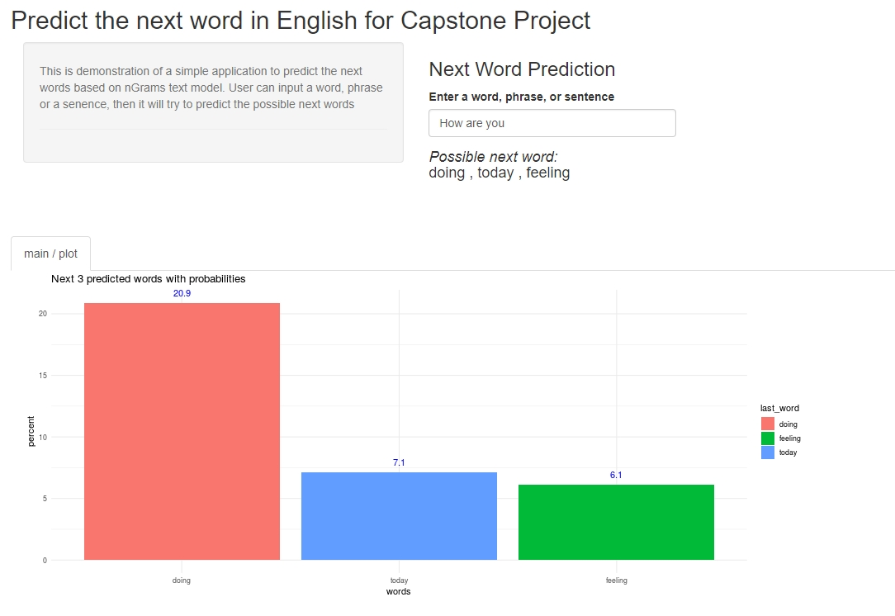

TextPredictor
========================================================
author: Arijit Nath
date: 20 December 2018
transition: rotate
autosize: true

This presentation is created to demonstrate the Shinny [TextPredictor](https://arijitnath.shinyapps.io/TextPredictor/) application which is developed as part of [Data Science Specialization](https://www.coursera.org/specializations/jhu-data-science) course by Coursera.

Objective
========================================================

The objective of this app is to predict the next word from the list of words as entered by the user. We have used Natural Language Processing(NLP) to build nGram models to predict most likely next words from a sequence of words.

Possible application includes software applications which involves a lot of typing. It can improve the overall user experience. E.g. Swiftkey or like applications on mobile devices.

Prediction Model 
========================================================
Below steps are in order to develop the Prediction Mode

<b>nGram model</b>
<small>
- We have used 3 different types of text data sources(Blogs, News, & Twitter) for our model.
- Take a random sample of the dataset which we used in our model and Tokenize the data and remove unwanted characters like numbers, symbols, punctuations etc.
- Dataframes are created from nGram document feature matrix. Dataframes contains words from nGram, Frequency, & the last word and soreted based on Frequency so that we can get most likely word.
</small>
<b>Word Prediction</b>
<small>
- Dataframe that we have created in nGram model will be used to predict the next likely word.
- Based on the inut string/words from the user, it will create multiple hint variables with word lengths from 1 to 5. These variables will be created from last word till last 5 words.
- Using the above hint variables we search each of the nGram model dataframe for possible match. 
- If any match found then the prodiction function returns only 3 most probable/frequent words.
- If no match found, then it return the word "the" as it is most frequent.
</small>

Using the Shiny App
========================================================
To use the app, please link on the hyperlink, [TextPredictor](https://arijitnath.shinyapps.io/TextPredictor/) and enter any phrase/words in the text input box. The app will show 3 most likely next words in descending order of frequency.

Below screenshot shows that if user entered - "How are you", our prediction model shows next 3 possible words as 1. "doing", 2. "today", 3. "feeling"

Resources
========================================================
- Shiny app: https://arijitnath.shinyapps.io/TextPredictor/
- Github project files: https://github.com/CaraJohnson/DataScienceCapstone
- Milestone Report: http://rpubs.com/CaraJ/434780
